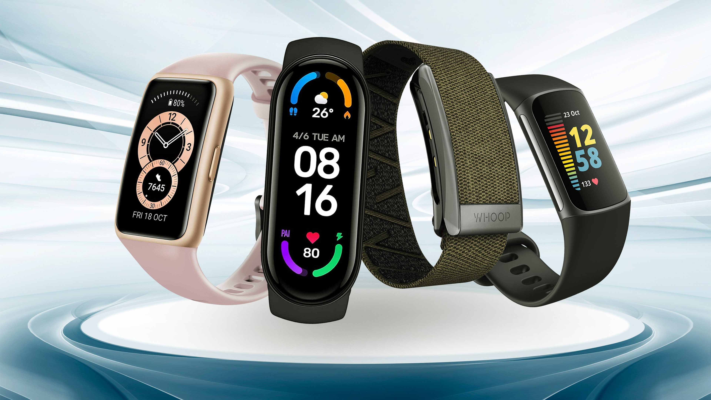

## 1. About the Company
Bellabeat is a high-tech manufacturer of women's health products. Bellabeat is a successful little business with the potential to grow into a major player in the global smart device industry. Urka Sren, cofounder and Chief Creative Officer of Bellabeat, believes that examining smart device fitness data could help the company discover new development prospects.


## 2. The Ask Phase
Where I get to ask the right questions to understand the business questions and also identify key stakeholders on the project.

#### Business Questions
* What are some trends in smart device usage?
* How could these trends apply to Bellabeat customers?
* How could these trends help influence Bellabeat marketing strategy?

#### The Business Task
How consumers use non-Bellabeat smart devices to gain insights

#### Stakeholders Involved
* Urka Sren - The cofounder and Chief Creative Officer of Bellabeat.
* Sando Mur - Bellabeat cofounder and key member of Bellabeat executive team
* The Marketing Analytics team at Bellabeat


## 3. The Prepare Phase
Here's where I get to gather the dataset to use, identify the source, the security, credibility and integrity.

#### Dataset used
The fitbit fitness tracker public data will be used for this analysis. [Here](https://www.kaggle.com/datasets/arashnic/fitbit)




#### Data Accessibility and Data Privacy
By verifying the metadata of our dataset, we can confirm that it is open-source. The owner has dedicated the work to the public domain by waiving all of his or her rights to the work worldwide under copyright law, including all related and neighboring rights, to the extent permitted by law. You may copy, modify, distribute, and perform the work without asking permission.

#### Key Information About Our Dataset
These datasets were created by respondents to a distributed survey via Amazon Mechanical Turk between December 3rd and December 5th, 2016. Thirty (30) Fitbit users agreed to submit personal tracker data, including minute-level output for physical activity, heart rate, and sleep monitoring. The variation in output represents the use of various Fitbit trackers and individual tracking behaviors/preferences.

#### Credibility and Integrity of Data
This Kaggle data set contains thirty fitbit users' personal fitness trackers. Thirty Fitbit users agreed to submit personal tracker data, including minute-level output for physical activity, heart rate, and sleep monitoring. It contains data on daily activity, steps, and heart rate that can be used to investigate users' habits.


## 4. The Process Phase
In this phase we will carryout some data cleaning and formatting tasks to ensure the data variables are thorough and ready for visualization.

#### Setting Up My Environment
Setting up my R environment by loading the 'tidyverse' and other needed packages

```{r}
library(tidyverse)  # Data import and wrangling
library(ggplot2)    # For data Visualization
library(dplyr)
library(tidyr)
library(scales)   # For transforming numbers in percentage
```

#### Get To Know Our Working Directory

```{r echo=TRUE}
getwd()   # Displays the working directory
```

#### Importing The Datasets
There are 18 csv files in the dataset. Each of them displays data related to the device's various functions: calories, activity level, daily steps, and so on.

To simplify the analysis, we will concentrate on daily data in this study.

###### Daily Activity
```{r}
daily_activity <- read_csv("Fitabase Data 4.12.16-5.12.16/dailyActivity_merged.csv")
View(daily_activity)
```

###### Daily Calories
```{r}
daily_calories <- read_csv("Fitabase Data 4.12.16-5.12.16/dailyCalories_merged.csv")
```

###### Daily Intensities
```{r}
daily_intensities <- read_csv("Fitabase Data 4.12.16-5.12.16/dailyIntensities_merged.csv")
```

######  Daily Steps
```{r}
daily_steps <- read_csv("Fitabase Data 4.12.16-5.12.16/dailySteps_merged.csv")
```

###### Daily Sleep
```{r}
daily_sleep <- read_csv("Fitabase Data 4.12.16-5.12.16/sleepDay_merged.csv")
```

###### Weight
```{r}
weight_info <- read_csv("Fitabase Data 4.12.16-5.12.16/weightLogInfo_merged.csv")
```

#### Preview Datasets
Let have a look at the various datasets and have a clear understanding of how they look, similarities and cohesion between the various datasets.

###### Daily Activity
```{r}
View(daily_activity)
```

###### Daily Calories
```{r}
View(daily_calories)
```

###### Daily Intensities
```{r}
View(daily_intensities)
```

######  Daily Steps
```{r}
View(daily_steps)
```

###### Daily Sleep
```{r}
View(daily_sleep)
```

###### Weight
```{r}
View(weight_info)
```

#### Cleaning and Formatting Our Dataset
After examining the various data sets, it is possible to conclude that table 1 (Daily activity) already contains information from table 2 (Daily calories), table 3 (Daily steps), and table 4 (Daily intensities). Another observation is that each dataset has the same number of observations. As a result, those dataframes will be removed.

```{r}
rm(daily_calories, daily_intensities, daily_steps) #(removing tables)
```

#### Transforming the data to be homogeneous
Before merging the datasets, let’s clean the date columns to make them homogeneous and transform them to right data type.
```{r}
# Cleaning the variables
daily_activity <- daily_activity %>% 
  rename(Date = ActivityDate) %>% 
  mutate(Date = as.Date(Date, format = "%m/%d/%y"))

daily_sleep <- daily_sleep %>% 
  rename(Date = SleepDay) %>% 
  mutate(Date = as.Date(Date, format = "%m/%d/%y"))

weight_info <- weight_info %>% 
  select(-LogId) %>% 
  mutate(Date = as.Date(Date, format = "%m/%d/%y")) %>% 
  mutate(IsManualReport = as.factor(IsManualReport))
```

#### Merging the Datasets
```{r}
final_data <- merge(merge(daily_activity, daily_sleep, by=c('Id','Date'), all = TRUE), weight_info, by = c('Id','Date'), all = TRUE)
```

#### Viewing the Merged dataframe (final_data)
```{r}
View(final_data)
```

#### Removing extra/irrelevant variables
```{r}
final_data <- final_data %>% 
  select(-c(TrackerDistance, LoggedActivitiesDistance, TotalSleepRecords, WeightPounds, Fat, BMI, IsManualReport))
```

#### Reviewing the Merged dataframe (final_data) again after removing unwanted variables
```{r}
View(final_data)
```

#### Checking the variables & data types
```{r}
str(final_data)
```
We can see that majority of the variables are numerical.
```{r}
summary(final_data)
```


## 5. The Analyze and Share Phase
In this phase we will be plotting various graphs to analyze our dataset for possible findings.

#### Users Daily Activity
Now with data merged, we can check for Users daily activities in a simple box plot
```{r}
final_data %>% 
  mutate(weekdays = weekdays(Date)) %>% 
  select(weekdays, TotalSteps) %>% 
  mutate(weekdays = factor(weekdays, levels = c('Monday', 'Tuesday', 'Wednesday', 'Thursday', 'Friday', 'Saturday', 'Sunday'))) %>% 
  drop_na() %>% 
  ggplot(aes(weekdays, TotalSteps, fill = weekdays)) +
  geom_boxplot() +
  scale_fill_brewer(palette="Set2") +
  theme(legend.position="none") +
  labs(title = "Users' activity by day",x = "Day of the week",y = "Steps",
    caption = 'Data Source: FitBit Fitness Tracker Data')
```

#### Next, Check for Calories burned by Steps Taken
Check for calories calories burned by steps (i.e Calories vs Total Steps)
```{r}
final_data %>% 
  group_by(TotalSteps, Calories) %>% 
  ggplot(aes(x = TotalSteps, y = Calories, color = Calories)) +
  geom_point() +
  geom_smooth() + 
  theme(legend.position = c(.8, .3),
        legend.spacing.y = unit(1, "mm"), 
        panel.border = element_rect(colour = "black", fill=NA),
        legend.background = element_blank(),
        legend.box.background = element_rect(colour = "black")) +
  labs(title = 'Calories burned by total steps taken',y = 'Calories',
       x = 'Total Steps',caption = 'Data Source: FitBit Fitness Tracker Data')
```

##### Findings: The more steps taken in a day, the more calories burned
These two variables have a clear positive correlation: the more steps taken in a day, the more calories burned. To verify this assumption, we can use the Pearson Correlation Coefficient to examine the correlation between these two variables.

Simply put, the Pearson Correlation Coefficient is a measure of two variables' linear correlation. [Click here](https://en.wikipedia.org/wiki/Pearson_correlation_coefficient) for more information.

```{r}
cor.test(final_data$TotalSteps, final_data$Calories, method = 'pearson', conf.level = 0.95)
```

With a confidence level of 95%, the correlation between the variables is almost 0.6. This means that there is a strong relationship between the variables.

#### Next, Check for Intensity of Excercise Activity
```{r}
final_data %>% 
  select(VeryActiveDistance, 
         ModeratelyActiveDistance, 
         LightActiveDistance) %>% 
  summarise(across(everything(), list(sum))) %>% 
  gather(activities, value) %>% 
  mutate(ratio = value / sum(value),
         label = percent(ratio %>% round(4))) %>% 
  mutate(activities = factor(activities,labels = c('Light Activity','Moderate Activity', 'Heavy Activity'))) %>% 
  ggplot(aes(x = (activities),y = value,label = label,fill = activities)) +
  geom_bar(stat='identity') +
  geom_label(aes(label = label),fill = "beige", colour = "black",vjust = 0.5) +
  scale_fill_brewer(palette="Accent") +
  theme(legend.position="none") +
  labs(title = "Intensity of exercise activity",x = "Activity level",
    y = "Distance", caption = 'Data Source: FitBit Fitness Tracker Data')
```

From the analysis above, the most common level of activity during exercise is light.

#### Next, Sleep Distribution
```{r}
final_data %>% 
  select(TotalMinutesAsleep) %>% 
  drop_na() %>% 
  mutate(sleep_quality = ifelse(TotalMinutesAsleep <= 420, 'Less than 7h',
                                ifelse(TotalMinutesAsleep <= 540, '7h to 9h', 
                                       'More than 9h'))) %>%
  mutate(sleep_quality = factor(sleep_quality, 
                                levels = c('Less than 7h','7h to 9h',
                                           'More than 9h'))) %>% 
  ggplot(aes(x = TotalMinutesAsleep, fill = sleep_quality)) +
  geom_histogram(position = 'dodge', bins = 30) +
  scale_fill_manual(values=c("tan1", "#66CC99", "lightcoral")) +
  theme(legend.position = c(.80, .80),legend.title = element_blank(),legend.spacing.y = unit(0, "mm"), 
        panel.border = element_rect(colour = "black", fill=NA),
        legend.background = element_blank(),legend.box.background = element_rect(colour = "black")) +
    labs(title = "Sleep distribution",x = "Time slept (minutes)",y = "Count",
    caption = 'Data Source: FitBit Fitness Tracker Data')
```

This graph depicts the users' average minutes of sleep, which follows a normal distribution. The majority of users sleep for 320 to 530 minutes.

#### Sleep Vs Distance Covered
```{r}
final_data %>% 
    select(Id, TotalDistance, TotalMinutesAsleep) %>% 
    group_by(Id) %>% 
    summarise_all(list(~mean(., na.rm=TRUE))) %>% 
    drop_na() %>% 
    mutate(Id = factor(Id)) %>% 
    ggplot() +
    geom_bar(aes(x = Id, y = TotalDistance), stat = "identity", fill = 'lightblue', alpha = 0.7) +
    geom_point(aes(x = Id, y = TotalMinutesAsleep/60), color = 'gold4') +
    geom_segment(aes(x = Id, xend = Id, y = 0, yend = TotalMinutesAsleep/60), color = 'gold4' ,group = 1) +
    scale_y_continuous(limits=c(0, 12), name = "Total Distance", 
                       sec.axis = sec_axis(~.*60, name = "Sleep in minutes")) +
    theme(axis.text.x = element_text(angle = 45, hjust = 1)) +
    theme(axis.title.y.right = element_text(color = "gold4"),axis.ticks.y.right = element_line(color = "gold4"),
          axis.text.y.right = element_text(color = "gold4")) +
    labs(
      title = "Average distance vs average sleep by user",x = "Users",
      caption = 'Data Source: FitBit Fitness Tracker Data')
```

We can see that covering a greater distance does not always imply that the user will have a better night's sleep (on average).

Let's put this theory to the test with the following graph.- By breaking sleeping hours by steps

```{r}
final_data %>% 
    select(TotalMinutesAsleep, TotalSteps) %>% 
    mutate(sleep_quality = ifelse(TotalMinutesAsleep <= 420, 'Less than 7h',
                                  ifelse(TotalMinutesAsleep <= 540, '7h to 9h', 
                                         'More than 9h'))) %>% 
    mutate(active_level = ifelse(TotalSteps >= 15000,'More than 15,000 steps',
                                 ifelse(TotalSteps >= 10000,'10,000 to 14,999 steps',
                                        ifelse(TotalSteps >= 5000, '5,000 to 9,999 steps',
                                               'Less than 4,999 steps')))) %>% 
    select(-c(TotalMinutesAsleep, TotalSteps)) %>% 
    drop_na() %>% 
    group_by(sleep_quality, active_level) %>% 
    summarise(counts = n()) %>% 
    mutate(active_level = factor(active_level, 
                                 levels = c('Less than 4,999 steps',
                                            '5,000 to 9,999 steps',
                                            '10,000 to 14,999 steps',
                                            'More than 15,000 steps'))) %>% 
    mutate(sleep_quality = factor(sleep_quality, 
                                  levels = c('Less than 7h','7h to 9h',
                                             'More than 9h'))) %>% 
    ggplot(aes(x = sleep_quality, 
               y = counts, 
               fill = sleep_quality)) +
    geom_bar(stat = "identity") +
    scale_fill_manual(values=c("tan1", "#66CC99", "lightcoral")) +
    facet_wrap(~active_level, nrow = 1) +
    theme(legend.position = "none") +
    theme(axis.text.x = element_text(angle = 45, hjust = 1)) +
    theme(strip.text = element_text(colour = 'black', size = 8)) +
    theme(strip.background = element_rect(fill = "beige", color = 'black'))+
    labs(
      title = "Sleep quality by steps",
      x = "Sleep quality",
      y = "Count",
      caption = 'Data Source: FitBit Fitness Tracker Data')
```

It appears that the best sleep is obtained when the total steps taken during the day are less than 9,999 steps.

#### Weight Vs Distance covered
```{r}
final_data %>% 
    select(Id, WeightKg, TotalDistance) %>% 
    group_by(Id) %>% 
    summarise_all(list(~mean(., na.rm=TRUE))) %>% 
    drop_na() %>% 
    mutate(Id = factor(Id)) %>% 
    ggplot(aes(WeightKg, TotalDistance, fill = Id)) +
    geom_point(aes(color = Id, size = WeightKg), alpha = 0.5) +
    scale_size(range = c(5, 20)) +
    theme(legend.position = "none") +
    labs(
      title = "Weight (kg) vs distance covered",
      x = "Kilograms",
      y = "Total Distance",
      caption = 'Data Source: FitBit Fitness Tracker Data')
```

In the gragh above, we can see that a majority of people that are in good shape and takes steps (move) above 5 miles. However, there is one outlier that moves very little and weighs significantly more than the rest.


## 6. The Act Phase
Finally, in this phase I get to share with the stakeholders my suggestions and conclusions based on the finds in our analysis.

#### Findings & Conclusions:
* Steps taken on a daily basis burn calories. Bellabeat could recommend a minimum number of steps for users to take (per day) based on their objectives to encourage them to achieve their goals.
* Bellabeat could send a notification (in the form of a pop up or calendar update) at a specific time for the user to remain consistent throughout the week in order to create a daily habit of exercising for its users.
* Furthermore, the data shows that light to moderate exercise is the best type of exercise for improving sleep (less than 10,000 steps). Bellabeat may recommend this level of exercise for people who want to live a healthy lifestyle but do not participate in high-level sports.
* Bellabeat may also think about gamification for some users who aren't motivated by notifications. The game can be designed to reward players based on the number of steps they take each day. To advance to the next level, you must maintain your activity level for a period of time (perhaps a month). For each level, you will receive a certain number of stars that can be redeemed for merchandise or discounts on other Bellabeat products.


-----------------------------------------
Thank you very much!

Special thanks to [Miguel Fzzz](https://www.kaggle.com/miguelfzzz) for his contribution to the open source community in assisting people to learn and be influenced by the approach by referring to case studies (as used in this analysis).
